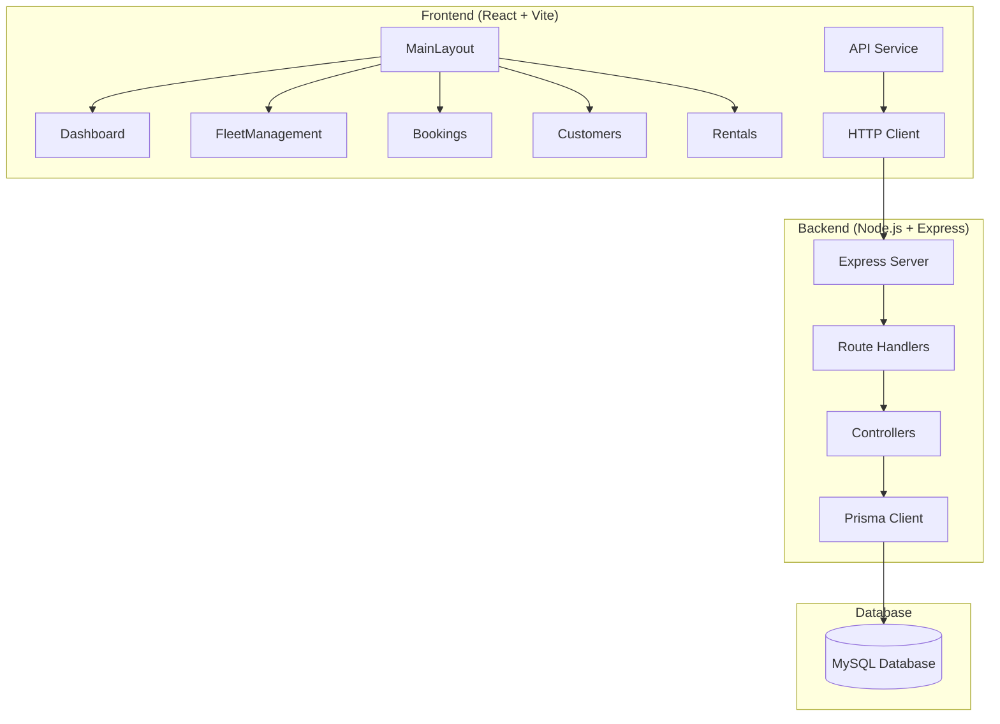

# Design Document

## Overview

This design addresses the completion of a partially implemented Car Rental Management System. The system consists of a React frontend with Vite and a Node.js backend with Express and Prisma ORM. The primary objective is to implement missing frontend components, complete backend API endpoints, and establish proper frontend-backend integration to create a fully functional car rental management application.

The system follows a traditional three-tier architecture with a React-based presentation layer, Express.js application layer, and MySQL database with Prisma ORM for data persistence. The design emphasizes modularity, maintainability, and proper separation of concerns.

## Architecture

### System Architecture



### Technology Stack

**Frontend:**
- React 19.2.6 with functional components and hooks
- Vite 8.0.12 for build tooling and development server
- React Router for client-side routing
- React Hot Toast for notifications
- Tailwind CSS for styling (already configured)

**Backend:**
- Node.js with Express 5.2.1
- Prisma 7.8.0 as ORM with MySQL database
- CORS for cross-origin requests
- bcryptjs for password hashing (if authentication is added later)
- jsonwebtoken for JWT tokens (if authentication is added later)

**Database:**
- MySQL with comprehensive schema including Cars, Customers, Bookings, Rentals, Categories, etc.

## Components and Interfaces

### Frontend Components

#### 1. MainLayout Component
**Location:** `frontend/src/layouts/MainLayout.jsx`

**Purpose:** Provides consistent navigation and layout structure for all pages using React Router's Outlet pattern.

**Key Features:**
- Responsive sidebar navigation
- Header with system branding
- Outlet for nested route rendering
- Active route highlighting
- Mobile-responsive hamburger menu

**Interface:**
```javascript
// MainLayout.jsx
const MainLayout = () => {
  // Navigation state management
  // Sidebar toggle functionality
  // Active route detection
  return (
    <div className="layout-container">
      <Sidebar />
      <main className="main-content">
        <Header />
        <Outlet /> {/* Renders child routes */}
      </main>
    </div>
  );
};
```

#### 2. Dashboard Component
**Location:** `frontend/src/pages/Dashboard.jsx`

**Purpose:** Displays system overview with key metrics and recent activity.

**Key Features:**
- Statistics cards (total rentals, available cars, customers, revenue)
- Recent bookings table
- Loading states and error handling
- Real-time data updates

**Interface:**
```javascript
// Dashboard.jsx
const Dashboard = () => {
  const [stats, setStats] = useState({});
  const [recentBookings, setRecentBookings] = useState([]);
  const [loading, setLoading] = useState(true);
  
  // Fetch dashboard data
  // Display metrics and recent activity
};
```

#### 3. FleetManagement Component
**Location:** `frontend/src/pages/FleetManagement.jsx`

**Purpose:** Manages vehicle inventory with CRUD operations.

**Key Features:**
- Vehicle listing with filtering and search
- Add/Edit vehicle modal forms
- Status management (Available, In Use, Maintenance)
- Category and pricing information
- Delete protection for vehicles with active bookings

**Interface:**
```javascript
// FleetManagement.jsx
const FleetManagement = () => {
  const [cars, setCars] = useState([]);
  const [categories, setCategories] = useState([]);
  const [branches, setBranches] = useState([]);
  const [fuelPolicies, setFuelPolicies] = useState([]);
  
  // CRUD operations for vehicles
  // Form handling and validation
};
```

#### 4. API Service Module
**Location:** `frontend/src/services/api.js`

**Purpose:** Centralized HTTP client for backend communication.

**Key Features:**
- Axios-based HTTP client with base URL configuration
- Request/response interceptors for error handling
- Consistent error response formatting
- CORS handling

**Interface:**
```javascript
// api.js
const api = axios.create({
  baseURL: 'http://localhost:3000/api',
  headers: {
    'Content-Type': 'application/json',
  },
});

// Request interceptor
// Response interceptor for error handling
export default api;
```

### Backend Components

#### 1. Express Server Setup
**Location:** `backend/src/server.js` or `backend/index.js`

**Purpose:** Main server configuration and startup.

**Key Features:**
- Express app initialization
- Middleware configuration (CORS, JSON parsing)
- Route mounting
- Database connection
- Error handling middleware

#### 2. Route Handlers
**Location:** `backend/src/routes/`

**Purpose:** Define API endpoints and route organization.

**Files:**
- `customerRoutes.js` - Customer management endpoints
- `carRoutes.js` - Fleet management endpoints  
- `bookingRoutes.js` - Booking management endpoints
- `rentalRoutes.js` - Rental management endpoints
- `dashboardRoutes.js` - Dashboard statistics endpoints

#### 3. Controllers
**Location:** `backend/src/controllers/`

**Purpose:** Business logic and database operations.

**Existing:** `customerController.js` (already implemented)
**Missing:** 
- `carController.js` - Fleet management operations
- `bookingController.js` - Booking CRUD and cost calculation
- `rentalController.js` - Rental operations and car returns
- `dashboardController.js` - Statistics aggregation

#### 4. Prisma Client Integration
**Purpose:** Database operations through Prisma ORM.

**Key Features:**
- Connection management
- Query optimization with includes/relations
- Transaction handling for complex operations
- Error handling for constraint violations

## Data Models

### Core Entities

The system uses the existing Prisma schema with the following key entities:

#### Car Entity
```javascript
{
  CarID: number,
  LicensePlate: string,
  Model: string,
  Brand: string,
  Year: number,
  Status: string, // 'Available', 'In Use', 'Maintenance'
  CategoryID: number,
  BranchID: number,
  PolicyID: number,
  // Relations
  category: Category,
  branch: Branch,
  fuelPolicy: FuelPolicy,
  bookings: Booking[]
}
```

#### Customer Entity
```javascript
{
  CustID: number,
  FullName: string,
  Email: string,
  Phone: string,
  StreetAddress: string,
  City: string,
  State: string,
  ZipCode: string,
  DriverLicenseNo: string,
  // Relations
  bookings: Booking[]
}
```

#### Booking Entity
```javascript
{
  BookingID: number,
  BookingDate: DateTime,
  PickupDate: DateTime,
  ReturnDate: DateTime,
  Status: string, // 'Pending', 'Confirmed', 'Active', 'Completed', 'Cancelled'
  CustID: number,
  CarID: number,
  // Relations
  customer: Customer,
  car: Car,
  rental: Rental,
  payments: Payment[]
}
```

### API Response Format

All API endpoints follow a consistent response format:

**Success Response:**
```javascript
{
  success: true,
  data: any, // The actual response data
  message?: string // Optional success message
}
```

**Error Response:**
```javascript
{
  success: false,
  error: string, // Error message
  details?: any // Optional error details
}
```

## Error Handling

### Frontend Error Handling

1. **API Service Level:**
   - Axios interceptors catch HTTP errors
   - Network errors and timeouts handled gracefully
   - Consistent error message formatting

2. **Component Level:**
   - Try-catch blocks around async operations
   - Loading states during API calls
   - Toast notifications for user feedback
   - Form validation errors

3. **User Experience:**
   - Loading spinners during data fetching
   - Error boundaries for component crashes
   - Graceful degradation when services are unavailable

### Backend Error Handling

1. **Database Errors:**
   - Prisma constraint violations (unique, foreign key)
   - Connection errors and timeouts
   - Transaction rollbacks on failures

2. **Validation Errors:**
   - Required field validation
   - Data type validation
   - Business rule validation

3. **HTTP Errors:**
   - 400 Bad Request for validation errors
   - 404 Not Found for missing resources
   - 500 Internal Server Error for system errors

## Testing Strategy

### Unit Testing Approach

**Frontend Testing:**
- Component rendering tests using React Testing Library
- Service function tests with mocked API calls
- Form validation and user interaction tests
- Error handling and loading state tests

**Backend Testing:**
- Controller function tests with mocked Prisma client
- Route handler tests with supertest
- Database operation tests with test database
- Error handling and validation tests

**Integration Testing:**
- End-to-end API tests covering complete workflows
- Frontend-backend integration tests
- Database constraint and relationship tests
- CORS and authentication flow tests

### Test Configuration

**Frontend:**
- Jest and React Testing Library for component tests
- MSW (Mock Service Worker) for API mocking
- Minimum 80% code coverage for critical components

**Backend:**
- Jest for unit and integration tests
- Supertest for HTTP endpoint testing
- Test database with Prisma migrations
- Minimum 85% code coverage for controllers and routes

**Property-Based Testing Assessment:**
This feature involves primarily CRUD operations, UI components, and infrastructure setup. Property-based testing is not appropriate for this type of system as:
- Most operations are simple database CRUD with deterministic behavior
- UI components are better tested with snapshot and interaction tests
- Infrastructure setup (Express server, database connections) should use integration tests
- The business logic is straightforward without complex algorithms or transformations

Therefore, the testing strategy focuses on unit tests with concrete examples, integration tests for API endpoints, and UI component tests rather than property-based testing.

## Implementation Notes

### Development Workflow

1. **Frontend Development:**
   - Start with missing components (MainLayout, Dashboard, FleetManagement)
   - Implement API service for backend communication
   - Add proper error handling and loading states
   - Ensure responsive design with Tailwind CSS

2. **Backend Development:**
   - Create Express server with proper middleware
   - Implement missing controllers and routes
   - Add comprehensive error handling
   - Test database operations with Prisma

3. **Integration:**
   - Configure CORS for frontend-backend communication
   - Test complete user workflows
   - Validate error handling across the stack
   - Performance optimization and caching

### Security Considerations

1. **Input Validation:**
   - Sanitize all user inputs on both frontend and backend
   - Validate data types and constraints
   - Prevent SQL injection through Prisma's parameterized queries

2. **CORS Configuration:**
   - Restrict origins to known frontend URLs
   - Configure appropriate headers and methods
   - Handle preflight requests properly

3. **Error Information:**
   - Avoid exposing sensitive system information in error messages
   - Log detailed errors server-side for debugging
   - Return user-friendly error messages to frontend

### Performance Considerations

1. **Database Optimization:**
   - Use Prisma's include/select for efficient queries
   - Implement pagination for large datasets
   - Add database indexes for frequently queried fields

2. **Frontend Optimization:**
   - Implement proper loading states
   - Use React's useMemo and useCallback for expensive operations
   - Lazy load components and routes when appropriate

3. **Caching Strategy:**
   - Cache static data (categories, branches, fuel policies)
   - Implement proper cache invalidation
   - Use browser caching for static assets